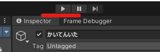

# 1.かいてんするいたをつくろう
## 回転するいたを作成


## なまえをかいてんいたにへんこうする


## Add Componentをクリックしてrigidbodyをついかする


## scriptsフォルダをついかする


## scriptsフォルダをひらいてc#scriptをついかする


## なまえをRotatePlateにへんこうする


## このコードをはりつける


```c#
using System.Collections;
using System.Collections.Generic;
using UnityEngine;

public class RotateSelf : MonoBehaviour
{
    [Tooltip("ごうたい")]
    Rigidbody rigidbody;

    [Tooltip("かいてんいたのかいてんするほうこうをきめます")]
    public bool rotationDirection;

    [Tooltip("かいてんいたのかいてんそくどをきめます")]
    public float rotateSpeed = 8.0f;

    void Start()
    {
        rigidbody = GetComponent<Rigidbody>();
    }

    void Update()
    {
        // かいてんいたをかいてんさせる
        if (rotationDirection)
        {
            rigidbody.angularVelocity = Vector3.forward * rotateSpeed;
        }
        else
        {
            rigidbody.angularVelocity = Vector3.forward * -rotateSpeed;
        }
    }
}

```

## さいせいぼたんをおしてゲームをじっこうしよう


## かいてんしながらかいてんいたがおちてしまいます


## UseGravityをオンにする


## ブロックがそのばでかいてんするようになりました
